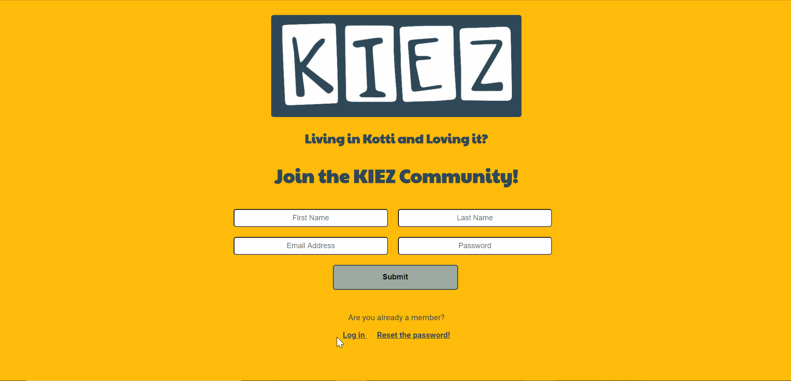
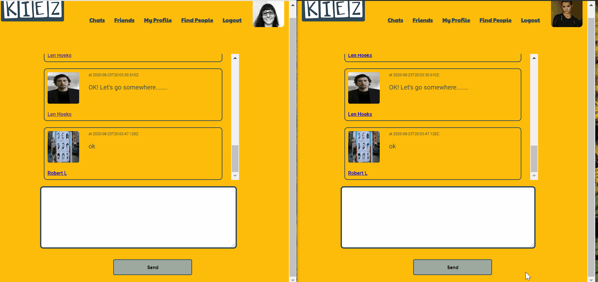

# KiezCommunity Social Network

## Description

KiezCommunity is a neighborhood social network. Users can register themselves on the webiste, upload their photo, write and edit their bio. They are able to search, add and delete friends, write on their friends wall or send them photos and gifs. There is also a live chat room for people to talk.
If users forget their passwords, an email will be send to their email address with a code to reset their passwords on the website.

## Technology

-   React
-   React Hooks
-   Redux
-   Node.js
-   Express.js
-   axios
-   PostgreSQL
-   AWS S3
-   AWS ses
-   Socket.io
-   csurf
-   cookie.session
-   Bcryptjs
-   HTML/CSS

## Features

-   Users can register or login to the website. A code will send to the email address of the user who forgot his or her password and they can make a new password with this code.
    On the "My Profile" page, user can upload a photo for her/his profile, write or edit the bio.

-   On the "Find People" page, users can see the last three people who registered themselves in the network and they can search for people.

-   After finding the person, user can go to her/his page and send them a friendship request. The person will receive the request and can accept or cancel it. On the "Firends" page, user can see her/his friends and also pending requests. Any changes in friendship status will show immediately on the page.

-   User can write on the friend's wall post or send them an image or a gif.

-   Moreover, there is a live chat room that all the users can chat with each other.

